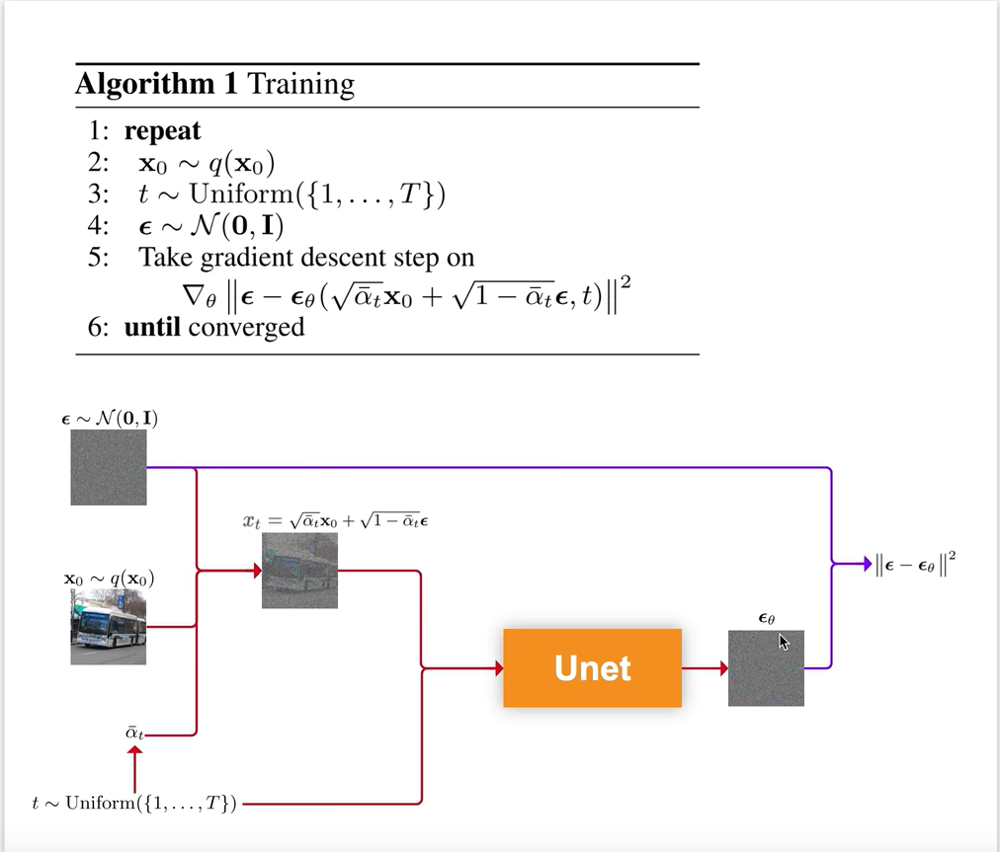
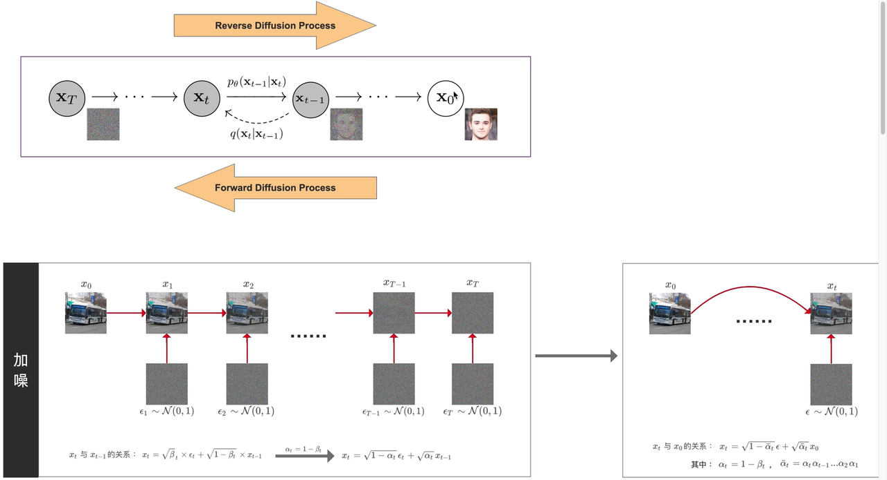
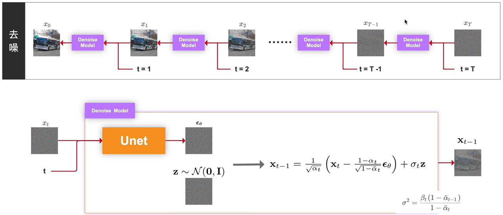

## Denoising Diffusion Probabilistic Models

An implementation of Denoising Diffusion Probabilistic Models for image generation written in PyTorch. This roughly follows the original code by Ho et al. Unlike their implementation, however, my model allows for class conditioning through bias in residual blocks. 

## 框架图

## 加噪

## 去噪

## 损失函数


## Resources

I gave a talk about diffusion models, NCSNs, and their applications in audio generation. The [slides are available here](resources/diffusion_models_talk_slides.pdf).

I also compiled a report with what are, in my opinion, the most crucial findings on the topic of denoising diffusion models. It is also [available in this repository](resources/diffusion_models_report.pdf).


## Acknowledgements

I used [Phil Wang's implementation](https://github.com/lucidrains/denoising-diffusion-pytorch) and [the official Tensorflow repo](https://github.com/hojonathanho/diffusion) as a reference for my work.

## Citations

```bibtex
@misc{ho2020denoising,
    title   = {Denoising Diffusion Probabilistic Models},
    author  = {Jonathan Ho and Ajay Jain and Pieter Abbeel},
    year    = {2020},
    eprint  = {2006.11239},
    archivePrefix = {arXiv},
    primaryClass = {cs.LG}
}
```

```bibtex
@inproceedings{anonymous2021improved,
    title   = {Improved Denoising Diffusion Probabilistic Models},
    author  = {Anonymous},
    booktitle = {Submitted to International Conference on Learning Representations},
    year    = {2021},
    url     = {https://openreview.net/forum?id=-NEXDKk8gZ},
    note    = {under review}
}
